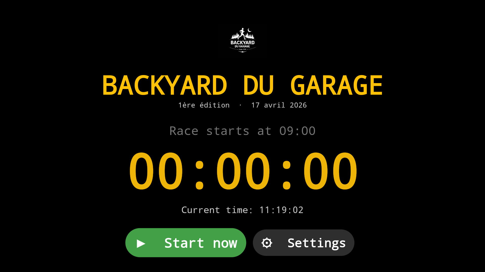
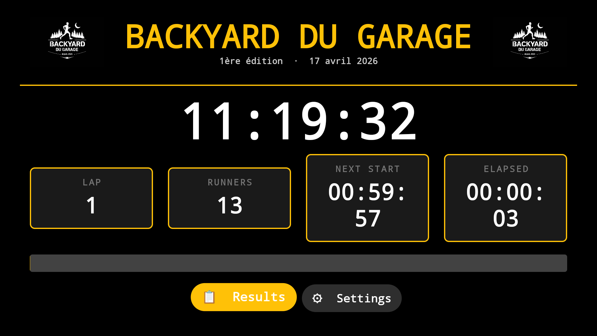
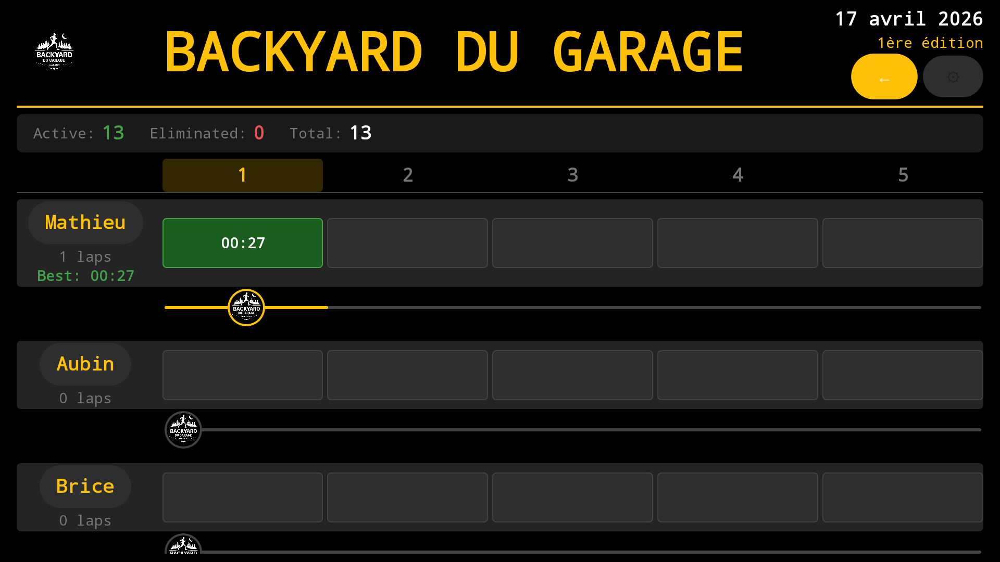

# BackyardManager

Android TV app for managing and tracking a **Backyard Ultra** race in real time.

## What is a Backyard Ultra?

A Backyard Ultra is a timed ultramarathon format where runners complete a 6.7 km loop every hour. The last runner still going wins. Any runner who fails to complete a loop within the hour is eliminated.

## Screenshots

| Countdown | Timer | Results |
|-----------|-------|---------|
|  |  |  |

## Features

- **Countdown screen** — displays the time remaining before the race starts with auto-start at the scheduled time
- **Timer screen** — live race clock, current lap, active runners count, lap progress bar (turns red in the last 30s), total elapsed race time
- **Results screen** — live grid of all runners × laps with:
  - Tap a runner's name to record their lap time for the current lap
  - Tap a lap cell to cycle its status (empty → completed → eliminated)
  - Runners sorted by their time on the current lap (fastest first), then alphabetically
  - Current lap column highlighted
  - Best lap time shown per runner
  - Life line showing each runner's photo advancing along a track as laps are completed
- **Settings screen** — configure race start time, manage runners, reset the race
- Runners who miss the lap cutoff are automatically eliminated with a time of **1:00:00**

## Tech Stack

| Layer | Technology |
|-------|-----------|
| UI | Jetpack Compose + AndroidX TV Material 3 |
| Architecture | MVVM (ViewModel + StateFlow) |
| Database | Room (SQLite) |
| Dependency Injection | Hilt |
| Navigation | Jetpack Navigation Compose |
| Language | Kotlin |
| Min SDK | 23 |
| Target SDK | 36 |

## Project Structure

```
app/src/main/java/com/athimue/backyard/
├── audio/          # SoundManager (lap start / end-lap warning)
├── composable/     # All screens (Countdown, Timer, Results, Settings, Navigation)
├── data/db/        # Room database, entities, DAOs
├── di/             # Hilt modules (DatabaseModule, RepositoryModule)
├── model/          # Domain models and UI state classes
├── repository/     # Repository interfaces and Room implementations
├── ui/theme/       # AppColors, AppTypography
└── viewmodel/      # ViewModels for each screen
```

## Build & Deploy

### Requirements
- Android Studio Hedgehog or later
- JDK 11+
- Android TV device or emulator

### Build debug APK

```bash
./gradlew assembleDebug
# Output: app/build/outputs/apk/debug/app-debug.apk
```

### Install on Android TV via ADB

1. On your TV: **Settings → Device Preferences → About** → tap **Build** 7 times to unlock Developer options
2. Enable **Developer options → USB debugging** and note the TV's IP address
3. From your machine:

```bash
adb connect <TV_IP_ADDRESS>
adb install app/build/outputs/apk/debug/app-debug.apk

# To update an existing installation:
adb install -r app/build/outputs/apk/debug/app-debug.apk
```

The app will appear in the Android TV launcher.
